<div align="center">
  
  <h1>HyperDesk</h1>
  <p><b>A VDI & VM Monitoring Tool based on Tauri and Rust</b></p>

  [](https://tauri.app/)
  [](https://react.dev/)
  [](https://www.rust-lang.org/)
  [](#)
  [](LICENSE)

  <br />

  <!-- 설치는 Microsoft Store 경유 — Microsoft가 서명·검증하고 자동 업데이트한다.
       GitHub 릴리즈의 .msixbundle은 Store 제출용 미서명 원본이라 직접 설치되지 않는다. -->
  [](https://apps.microsoft.com/detail/9NPVXL622ZQQ)
</div>

---

<div align="center">
  
</div>

<br />

<div align="center">
  
</div>


## Overview

**HyperDesk**는 Hyper-V 가상 머신과 RDP 원격 데스크톱 세션을 단일 인터페이스에서 통합 관리·모니터링하는 데스크톱 애플리케이션입니다.

Win32 API와 Tauri v2를 활용하여 독립된 외부 프로세스 윈도우를 앱 내부 슬롯에 임베딩(Window Swallowing)하는 방식으로 구현되었으며, VM 시작/중지부터 스냅샷, 네트워크 토폴로지, 이벤트 로그까지 하나의 대시보드에서 다룹니다.

> **지원 범위**: 현재 정식으로 동작이 확인된 대상은 **Hyper-V(VMConnect)와 RDP뿐**입니다. VMware/Omnissa Horizon 관련 코드(레지스트리 스캔, 외부 클라이언트 실행)가 일부 존재하지만 실사용에서 검증되지 않았고, 그리드 임베딩(SwallowGrid™)은 구조적 한계로 명시적으로 비활성화되어 있습니다.

## Key Features

### Window Embedding — SwallowGrid™
* **프로세스 종속성 관리**: RDP, VMConnect 등의 외부 프로세스 윈도우를 HyperDesk UI에 완벽하게 렌더링합니다.
* **Deadlock-Free 설계**: `AttachThreadInput`를 배제하고 독립적인 메시지 큐를 구성하여, 외부 프로세스에서 인증 모달 창이 발생해도 메인 UI의 프리징 현상이 발생하지 않습니다.
* **고속 동기화**: `requestAnimationFrame`과 백엔드 델타 필터링을 결합하여, 레이아웃 전환 및 리사이즈 시 외부 윈도우의 위치를 끊김 없이 추종합니다.
* **VMConnect 리본 마스킹**: VMConnect의 제거 불가능한 클라이언트 영역 리본을 `SetWindowRgn`으로 가려 완전히 매끄러운 슬롯을 제공합니다.
* **동시 유지, 전환 뷰**: 최대 4개의 세션을 백그라운드에 동시에 살려두고, `Alt + 1~4` 단축키(또는 헤더 버튼)로 슬롯을 즉시 전환합니다. 전환해도 세션은 끊기지 않습니다.

### Immersive Mode
* **VM 전체화면**: 활성 슬롯을 앱 UI 없이 화면 전체로 채워 세밀하게 관제할 수 있으며, 마우스를 화면 상단에 대면 헤더가 슬라이드로 다시 나타나고 ESC로 즉시 해제됩니다. Borderless 풀스크린이라 타이틀바 반짝임이 없습니다.
* **키보드 라우팅**: 활성 세션에 포커스가 있는 동안 Win 키/Alt+Tab 등 시스템 단축키를 VM 내부로 그대로 전달합니다.

### VM & Remote Asset Management
* **가상 머신 제어**: 시작/중지/저장/재개/일시정지는 물론, 메모리·프로세서 수를 즉시 조정할 수 있습니다.
* **스냅샷 & 체크포인트**: 생성/복원/삭제를 대시보드에서 바로 수행합니다.
* **원격 자산 관리**: 레지스트리에서 자동 감지된 RDP 접속 기록과 수동 등록 호스트를 병합해 보여주며, 자동 감지 항목도 이름 변경·숨김·삭제가 가능합니다.
* **메모 & 태그**: VM과 원격 자산 각각에 인앱 메모(노트패드 스타일)와 태그를 붙여 분류·검색할 수 있습니다.
* **목록 레이아웃 토글**: 원격 자산 목록을 1열/2열 그리드로 전환할 수 있습니다.

### Telemetry & Auto-Recovery
* **실시간 리소스 트래킹**: 각 가상 머신의 CPU, 메모리, 실제 디스크 여유 용량, IP 주소 및 업타임을 대시보드에서 파악할 수 있습니다.
* **비정상 종료 감지**: 타겟 윈도우 프로세스의 크래시를 감지하고, 지수 백오프(Exponential Backoff) 알고리즘을 통해 자동으로 재접속을 시도합니다.
* **스마트 사이징**: RDP `Smart Sizing`으로 슬롯 크기 변경 시에도 세션 재협상 없이 화면을 매끄럽게 맞춥니다.

### Network & Events
* **네트워크 토폴로지**: Hyper-V 가상 스위치와 어댑터 구성을 조회합니다.
* **이벤트 로그**: Hyper-V 관련 이벤트를 실시간 스트림 형태로 확인합니다.

### UX & Personalization
* **커맨드 팔레트**: `Ctrl+K`로 빠른 검색·전환·액션 실행이 가능합니다.
* **3가지 테마**: 다크 / 라이트 / 레트로 테마를 지원합니다.
* **안전 종료**: 창을 닫을 때 트레이로 최소화(세션 유지) / 완전 종료(세션 정리) / 취소 중 선택하는 확인 팝업이 뜹니다.
* **접이식 사이드바**: `Ctrl+B`로 사이드바를 접고 펼 수 있습니다.

## Tech Stack

* **Frontend**: React 19, TypeScript, Vite, Vanilla CSS, Framer Motion, Recharts, dotLottie
* **Backend**: Tauri v2, Rust
* **System API**: Win32 API (`SetParent`, `SetWindowPos`, `EnumWindows`, `SetWindowRgn` 등), PowerShell (Hyper-V 자동화), Windows Registry (RDP/Horizon 접속 기록 감지)
* **CI/CD**: GitHub Actions (Stable Rust Toolchain, v2 Release)

## Install

일반 사용자는 **Microsoft Store**에서 설치하세요 — Microsoft가 서명·검증하며 자동으로 업데이트됩니다.

> **[▶ Microsoft Store에서 설치](https://apps.microsoft.com/detail/9NPVXL622ZQQ)**

> ⚠️ GitHub 릴리즈에 첨부되는 `.msixbundle`은 **Store 제출용 미서명 원본**입니다. 직접 설치되지 않으니 위 Store 링크로 받으세요.

**요구 사항**
* Windows 10/11 · [WebView2 Runtime](https://developer.microsoft.com/en-us/microsoft-edge/webview2/) (Windows 11 기본 탑재)
* Hyper-V 기능 활성화. VM 관리(Get-VM/Start-VM 등)를 쓰려면 사용자 계정이 로컬 **Hyper-V Administrators** 그룹에 속해야 합니다 — 앱 자체는 관리자 권한 없이(asInvoker) 실행됩니다.

## Getting Started (개발)

### Prerequisites

* [Rust](https://www.rust-lang.org/tools/install) (1.80+)
* [Node.js](https://nodejs.org/) (LTS 권장)
* [WebView2 Runtime](https://developer.microsoft.com/en-us/microsoft-edge/webview2/) (Windows 10/11 기본 탑재)

### Installation & Development

```bash
# 의존성 패키지 설치
npm install

# 데브 모드 실행
npm run tauri dev
```

## License

Copyright © 2026 HyperDesk.

This software is licensed under the [PolyForm Noncommercial License 1.0.0](LICENSE) — free for noncommercial use; commercial use requires a separate license.
