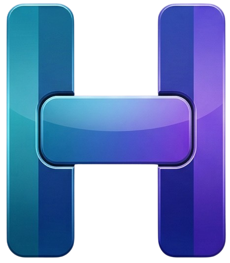

<div align="center">
  
  <h1>HyperDesk</h1>
  <p><b>Run your Hyper-V consoles and RDP sessions as real windows inside one app.</b></p>

  [](https://tauri.app/)
  [](https://react.dev/)
  [](https://www.rust-lang.org/)
  [](#)
  [](LICENSE)

  <br />

  **English** · [한국어](README.ko.md)

  <br />

  <!-- Install via the Microsoft Store — MS signs, verifies and auto-updates it.
       The .msixbundle on GitHub Releases is the unsigned submission artifact and
       will not install directly. -->
  [](https://apps.microsoft.com/detail/9NPVXL622ZQQ)
</div>

---

<div align="center">
  
</div>

<br />

<div align="center">
  
</div>

## What it does

Most remote-desktop managers give you tabs. HyperDesk gives you the **actual window**.

`mstsc.exe` and `vmconnect.exe` are reparented into the app with the Win32 `SetParent`
API, so a live RDP session or a Hyper-V console renders as a native child window inside
a HyperDesk slot — not a screenshot, not a re-implemented protocol client. Four sessions
stay alive at once; `Alt+1`–`4` pages between them instantly and nothing disconnects.

It also does the boring parts: start/stop VMs, snapshots, per-VM telemetry, the Hyper-V
event log, and a `Ctrl+K` palette to reach any of it.

> **Scope.** Hyper-V (VMConnect) and RDP are the verified targets. VMware/Omnissa Horizon
> code exists (registry scan, launching the external client) but is unverified in practice,
> and **grid embedding for Horizon is deliberately disabled** — its MKS child windows are
> pinned to absolute monitor coordinates and do not follow a reparented frame. Connecting
> to a Horizon host outside the grid works.

## Why you might want it

* **No credentials stored.** HyperDesk keeps a username at most. There is no vault, no
  password field, no secret at rest — Windows handles authentication. Nothing to leak.
* **Sessions survive switching.** Slots are hidden, never torn down.
* **It is not a browser tab.** The remote desktop is a real window with real input.
* **Free.** PolyForm Noncommercial — free for noncommercial use.

## Key features

### Window embedding — SwallowGrid™

* **External process embedding.** RDP and VMConnect windows are reparented into the
  HyperDesk UI and tracked as first-class slot content.
* **Deadlock-free by design.** `AttachThreadInput` is deliberately avoided. A credential
  or certificate dialog raised by the embedded process cannot freeze the host UI.
* **Tight position sync.** `requestAnimationFrame` on the front end plus delta filtering
  in Rust keeps the embedded window locked to its slot through layout changes and resizes.
* **VMConnect ribbon masking.** VMConnect's non-removable 30px client-area ribbon is
  clipped with `SetWindowRgn` so the slot shows only the guest.
* **Four live, one visible.** Up to four sessions run simultaneously; `Alt+1`–`4` (or the
  slot header) pages between them without reconnecting.

### Immersive mode

* **Full-screen VM.** The active slot fills the entire display with no app chrome. Push the
  cursor to the top edge and the header slides back in; `Esc` exits. Borderless, so there
  is no title-bar flash.
* **Keyboard routing.** While an embedded session holds focus, Win key and `Alt+Tab` are
  forwarded into the guest instead of being eaten by the host shell.

### VM and remote asset management

* **VM control.** Start, stop, save, resume, pause; adjust memory and processor count in place.
* **Snapshots.** Create, restore and delete from the dashboard.
* **Remote assets.** RDP history auto-detected from the registry is merged with manually
  registered hosts. Auto-detected entries can be renamed, hidden or removed.
* **Memos and tags.** Attach a notepad-style memo and tags to any VM or remote asset,
  then filter by `@tag` from the command palette.
* **Quick connect.** `Ctrl+K`, type an address, Enter. No registration step.

### Telemetry and recovery

* **Live resource tracking.** Per-VM CPU, memory, disk headroom, IP and uptime, plus host
  CPU/memory/disk sparklines beside the session rail.
* **Crash detection.** A watchdog notices when an embedded process dies and retries the
  connection with exponential backoff.
* **Smart sizing.** RDP smart sizing keeps the picture fitted when a slot changes size
  without renegotiating the session.

### Network and events

* **Network topology.** Inspect Hyper-V virtual switches and adapter configuration.
* **Event log.** Hyper-V events as a live stream.

### UX

* **Command palette.** `Ctrl+K` for search, navigation and actions.
* **Three themes.** Dark, light, and a Windows 9x retro skin.
* **English and Korean.** Detected from your OS locale, switchable in Settings.
* **Safe exit.** Closing the window asks: minimize to tray (sessions stay alive), quit
  completely (sessions are cleaned up), or cancel.
* **Collapsible sidebar.** `Ctrl+B`.

## Tech stack

* **Frontend** — React 19, TypeScript, Vite, plain CSS, Framer Motion, Recharts, dotLottie
* **Backend** — Tauri v2, Rust
* **System** — Win32 (`SetParent`, `SetWindowPos`, `EnumWindows`, `SetWindowRgn`, …),
  PowerShell for Hyper-V automation, Windows Registry for RDP/Horizon host discovery
* **CI/CD** — GitHub Actions (stable Rust toolchain, Tauri v2 release)

## Install

Install from the **Microsoft Store** — Microsoft signs, verifies and auto-updates it.

> **[▶ Install from the Microsoft Store](https://apps.microsoft.com/detail/9NPVXL622ZQQ)**

> ⚠️ The `.msixbundle` attached to GitHub Releases is the **unsigned Store submission
> artifact**. It will not install directly; use the Store link above.

**Requirements**

* Windows 10/11 with the [WebView2 Runtime](https://developer.microsoft.com/en-us/microsoft-edge/webview2/)
  (preinstalled on Windows 11)
* Hyper-V enabled. To manage VMs (`Get-VM`, `Start-VM`, …) your account must be in the
  local **Hyper-V Administrators** group — the app itself runs unelevated (`asInvoker`),
  and window embedding does not require admin.

## Development

### Prerequisites

* [Rust](https://www.rust-lang.org/tools/install) 1.80+
* [Node.js](https://nodejs.org/) (LTS)
* [WebView2 Runtime](https://developer.microsoft.com/en-us/microsoft-edge/webview2/)

### Run

```bash
npm install
npm run tauri dev     # Rust backend + React with HMR
```

### Other commands

```bash
npm run build         # TypeScript check + Vite bundle
npm test -- --run     # Frontend test suite
npm run tauri build   # Production build → NSIS installer

cd src-tauri
cargo test            # Rust unit tests
cargo clippy          # Rust lints
```

Architecture notes, Win32 constraints and the accumulated troubleshooting log live in
[CLAUDE.md](CLAUDE.md).

## License

Copyright © 2026 HyperDesk.

Licensed under the [PolyForm Noncommercial License 1.0.0](LICENSE) — free for
noncommercial use; commercial use requires a separate license.
