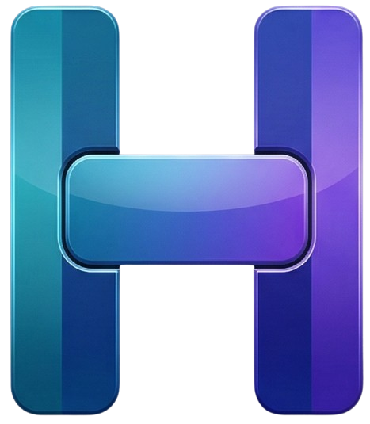

<div align="center">
  
  <h1>HyperDesk</h1>
  <p><b>Run your Hyper-V consoles, RDP sessions and Horizon desktops as real windows inside one app.</b></p>

  [](https://tauri.app/)
  [](https://react.dev/)
  [](https://www.rust-lang.org/)
  [](#)
  [](LICENSE)

  <br />

  **English** · [한국어](README.ko.md)

  <br />

  <!-- Install via the Microsoft Store — MS signs, verifies and auto-updates it.
       The .msixbundle on GitHub Releases is the unsigned submission artifact and
       will not install directly. -->
  [](https://apps.microsoft.com/detail/9NPVXL622ZQQ)
</div>

---

<div align="center">
  
</div>

<br />

<div align="center">
  
</div>

## What it does

Keep four remote sessions open and jump between them with one keystroke.

Press `Alt+1`, `Alt+2`, `Alt+3` or `Alt+4` and the matching session fills the view
instantly. Nothing reconnects, nothing reloads, and the sessions you left keep running in
the background. One full-size session at a time, switched in a keystroke, instead of four
shrunken ones side by side.

What makes this possible is that the sessions are the real client windows. The Remote
Desktop client (`mstsc.exe`), the Hyper-V console (`vmconnect.exe`) and the
Omnissa/VMware Horizon client are reparented into HyperDesk with the Win32 `SetParent`
API. They are not screenshots or a re-implemented protocol, so the real client's behaviour
comes along with them, including clipboard sharing and your saved Windows credentials.

Around that, HyperDesk handles the day-to-day Hyper-V work: starting and stopping VMs,
snapshots, per-VM resource usage, the Hyper-V event log, and a `Ctrl+K` palette that
reaches all of it.

## Built with React and Tauri, not Electron

HyperDesk is a React 19 app, but it is not a browser in a box.

- **Small.** The v1.3.0 installer is about 7.5 MB. There is no bundled Chromium: the UI
  runs on the WebView2 engine already built into Windows, through Tauri v2.
- **Rust where it matters.** Window embedding, keyboard hooks, the Hyper-V PowerShell
  bridge and registry discovery are written in Rust against the Win32 API directly, with
  no native add-on layer in between.
- **React where it's pleasant.** The interface is React 19 + TypeScript with TanStack
  Query for live data, Framer Motion for the session switcher, and Recharts for the
  graphs.
- **Locked down.** The web layer runs under a strict Content Security Policy and Tauri's
  permission system, and it talks to the Rust side only through one typed command
  module (`src/lib/tauri-api.ts`).

The unusual part is that a Tauri/WebView2 window hosts other programs' native windows and
keeps them in step with the React layout. The notes on how that works, and the Win32
edge cases it ran into, are in [CLAUDE.md](CLAUDE.md).

## Features

### Session switching (SwallowGrid™)

- **Real windows in slots.** RDP, Hyper-V console and Horizon sessions are embedded into
  the app and follow the slot through window moves, resizes and layout changes.
- **Four live, one visible.** Up to four sessions run at the same time. Switch with
  `Alt+1`–`4` or the session rail; hidden slots keep running.
- **Hyper-V console by VM name.** VMConnect is matched by the VM name in its window title,
  so the right console lands in the right slot even when VMConnect hands off to an
  existing instance. Its ribbon and border are clipped away so only the guest shows.
- **Horizon desktops.** The Horizon display surface is pinned to the slot. Horizon's
  connection bar is hidden.
- **Floating header.** A thin header pill sits on top of the session and can be dragged
  sideways. It holds the connection name, full-screen buttons and disconnect; in VM full
  screen it also shows the 1–4 slot switcher.
- **Full screen, two ways.** `F11` makes the app window full screen; the VM full-screen
  button also hides the app UI so the session gets the whole display. Leaving either
  returns you to exactly the state you entered from. `Esc` exits.
- **No deadlocks.** `AttachThreadInput` is never used, so a credential or certificate
  dialog in the embedded client cannot freeze HyperDesk.

### VM and remote asset management

- **VM control.** Start, stop, save, resume and pause; change memory and processor count
  in place; create new VMs.
- **Snapshots.** Create, restore and delete from the dashboard.
- **Remote assets.** RDP history and Horizon servers found in the registry are merged
  with hosts you add yourself. Detected entries can be renamed, hidden or removed.
- **Memos and tags.** Attach a memo and tags to any VM or host, then filter with `@tag`
  in the command palette.
- **Quick connect.** `Ctrl+K`, type an address, press Enter.
- **`rdp:` links.** HyperDesk can be chosen as the app that opens `rdp://` links. The
  link's host is added to your assets and opened in a slot. Only the address and user
  name are taken from the link; every other `.rdp` setting in it is ignored. You can take
  HyperDesk off that list again in Settings.

### Monitoring

- **Resource usage.** Per-VM CPU, memory, disk headroom, IP address and uptime, plus host
  CPU, memory and disk graphs next to the sessions.
- **Host status.** Each remote host gets a quick TCP check, so offline hosts show up
  before you try to connect.
- **Network.** Hyper-V virtual switches, the switch each VM is connected to, and host
  network traffic.
- **Event log.** Recent Hyper-V events (VMMS and worker logs) alongside HyperDesk's own
  activity.
- **Closed-session detection.** If an embedded client exits or crashes, the slot notices
  and offers a one-click reconnect instead of showing a dead window. It never reconnects
  on its own, so a session you logged off from stays closed.

### Everyday use

- **Command palette.** `Ctrl+K` for search, navigation and VM/host actions.
- **Three themes.** Dark, light, and a Windows 9x retro skin.
- **English and Korean.** Picked from your OS language, changeable in Settings.
- **Clean exit.** Closing HyperDesk releases every embedded window and ends those
  sessions, so no client is left stuck inside a closed app.
- **Collapsible sidebar.** `Ctrl+B`.

## Keyboard shortcuts

| Keys | Action |
|---|---|
| `Alt+1` – `Alt+4` | Switch slot (works even while a session has focus) |
| `F11` | App full screen on/off (Multi-View) |
| `Esc` | Leave full screen / VM full screen |
| `Ctrl+K` | Command palette |
| `Ctrl+B` | Collapse or expand the sidebar |

## Install

Install from the **Microsoft Store**. Microsoft signs and verifies the package and keeps
it updated.

> **[▶ Install from the Microsoft Store](https://apps.microsoft.com/detail/9NPVXL622ZQQ)**

> ⚠️ The `.msixbundle` attached to GitHub Releases is the **unsigned Store submission
> artifact**. It will not install directly; use the Store link above.

**Requirements**

- Windows 10 or 11 with the [WebView2 Runtime](https://developer.microsoft.com/en-us/microsoft-edge/webview2/)
  (included with Windows 11).
- Hyper-V enabled, if you want to manage VMs. Your account must be in the local
  **Hyper-V Administrators** group for `Get-VM`, `Start-VM` and the rest. HyperDesk itself
  runs without admin rights, and embedding windows does not need them.
- For Horizon slots, the Omnissa/VMware Horizon Client installed.

## Known limitations

- **The Windows key inside a session.** While a session has focus, the Windows key also
  opens the *local* Start menu. The remote clients do this themselves when their window is
  embedded, so HyperDesk cannot block it from outside. `Alt+Tab` and `Alt+1`–`4` are
  handled correctly.
- **RDP resolution.** Classic `mstsc` cannot change a session's resolution while it runs.
  When a slot changes size, the picture is scaled to fit (smart sizing) rather than
  re-rendered, so it can look soft after large changes. Reconnect for a sharp image.
- **Windows only.** HyperDesk is built on Win32 APIs and has no macOS or Linux version.

## Privacy

HyperDesk has no telemetry, analytics or accounts, and sends nothing to the developer.
It stores no passwords; logins are handled by the Remote Desktop and Horizon clients.
The only internet request is the optional update check in Settings, which you can turn
off for air-gapped networks. The full list of what it reads, stores and connects to is in
[PRIVACY.md](PRIVACY.md).

## Troubleshooting

| Symptom | What to check |
|---|---|
| VMs don't appear, or Start/Stop fails with a permission error | Add your account to the local **Hyper-V Administrators** group, then sign out and back in. |
| `Alt+1`–`4` stops working for no clear reason | Check Task Manager for a leftover `hyperdesk.exe` from an earlier run. An old instance holds the shortcuts; end it and restart HyperDesk. |
| An `rdp://` link opens a "can't reach localhost" page | The link is registered to a development build. In that build's Settings, remove the `rdp://` link registration, then open the link again and pick the installed HyperDesk. |
| A slot stays black | Disconnect the slot with its X button and connect again. If it keeps happening, please [open an issue](https://github.com/qetqet910/HyperDesk/issues). |

## Development

### Prerequisites

- [Rust](https://www.rust-lang.org/tools/install) 1.80+
- [Node.js](https://nodejs.org/) LTS
- [WebView2 Runtime](https://developer.microsoft.com/en-us/microsoft-edge/webview2/)

### Run

```bash
npm install
npm run tauri dev     # Rust backend + React with hot reload
```

### Other commands

```bash
npm run build         # TypeScript check + Vite bundle
npx vitest run        # Frontend tests
npm run tauri build   # Production build (NSIS installer)

cd src-tauri
cargo test            # Rust unit tests
cargo clippy          # Rust lints
```

Debug builds write a diagnostic log to `%TEMP%\hyperdesk-swallow.log`. It is the first
place to look when an embedded window misbehaves.

Architecture notes, Win32 constraints and the troubleshooting history are in
[CLAUDE.md](CLAUDE.md).

### Release

Pushing a `v*` tag builds and publishes the release through GitHub Actions
(`.github/workflows/release.yml`). Keep the version identical in `package.json`,
`src-tauri/tauri.conf.json`, `src-tauri/Cargo.toml` and `src-tauri/hyperdesk.exe.manifest`.

## Tech stack

- **Frontend:** React 19, TypeScript, Vite, plain CSS, Framer Motion, Recharts, dotLottie
- **Backend:** Tauri v2, Rust
- **System:** Win32 (`SetParent`, `SetWindowPos`, `SetWindowRgn`, low-level keyboard hooks),
  PowerShell for Hyper-V, the Windows Registry for RDP and Horizon host discovery

## License

[MIT](LICENSE). Third-party components and their licenses are listed in
[THIRD-PARTY-NOTICES.md](THIRD-PARTY-NOTICES.md).

HyperDesk is not affiliated with Microsoft, Broadcom (VMware) or Omnissa. Their product
names are trademarks of their respective owners.
